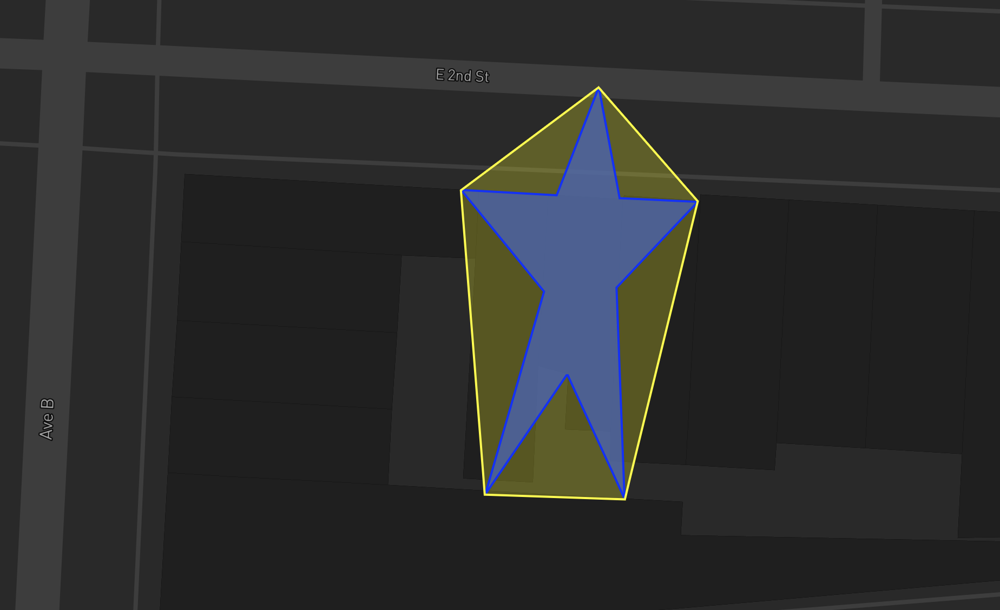

# geospatial_algos

Algorithms for storing, manipulating, and analyzing geospatial data.

## Algorithms

### Line Simplification
Reduce the complexity of a line geometry by removing points that don't meet a distance threshold. 


### Convex Hull
Enclose a set of points in a convex polygon by checking the cross product of vectors for candidate points.



## Pansharpening 
Combine data from lower resolution color imagery and higher resolution greyscale imagery to "sharpen" the color imagery, making it appear more detailed.

Input (low-res color photo):


Input (hi-res greyscale photo): 


Pansharpened result:


## Developing

1. Activate venv
    ``` bash
    python3 -m venv .venv
    source .venv/bin/activate
    ```
1. Install python requirements
    ``` bash
    pip3 install -r requirements.txt
    ```
1. Run tests
    ``` bash 
    pytest tests
    ``` 

## Updating Requirements

1. Add requirement to `requirements.in`
1. Compile the `requirements.txt` file
    ``` bash
    python3 -m pip install pip-tools
    pip-compile --output-file=requirements.txt requirements.in
    ```
1. Install python requirements
    ``` bash
    pip3 install -r requirements.txt
    ```